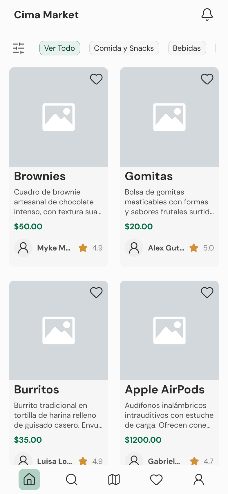
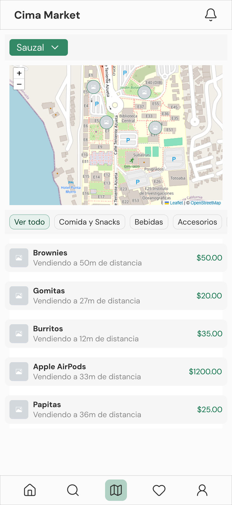
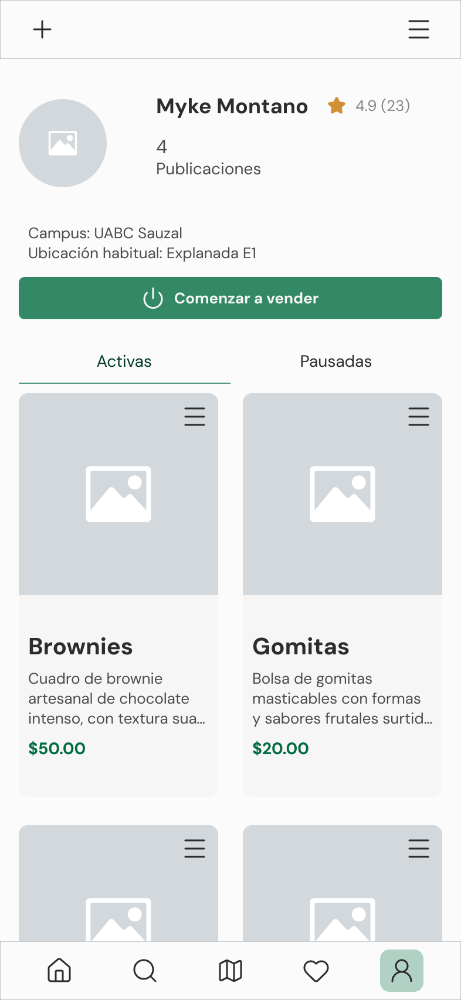

# Cima Market

Cima Market es un marketplace exclusivo para la comunidad estudiantil de la UABC (con soporte para los campus UABC Sauzal 
y UABC Valle Dorado en Ensenada). Diseñado para ofrecer una alternativa más ordenada y confiable a la compra-venta universitaria, facilita la búsqueda de productos y la conexión directa con los vendedores: catálogo centralizado, reseñas basadas en contacto real y un mapa de vendedores activos en tiempo real. No procesa pagos ni gestiona inventarios; su objetivo no es ser un e-commerce, sino resolver el descubrimiento de productos y fomentar la confianza.  

---

## 🎨 Diseño

**[Ver diseño completo en Figma →](https://www.figma.com/design/APbugWpkphXzc2A1SBtSca/Cima-Market?node-id=0-1&t=LgY9N373eTzmnozr-1)** Sistema de diseño, flujos de usuario y prototipo interactivo navegable.

---

## El problema

Actualmente, la compra-venta entre estudiantes de la UABC ocurre de forma dispersa e informal: grupos de Facebook sin estructura, chats de WhatsApp que se pierden entre cientos de mensajes, y ningún mecanismo para verificar que la otra persona realmente pertenece a la comunidad universitaria. No existe un lugar centralizado y verificado por correo institucional que le dé a un estudiante-vendedor exposición real para lo que vende, y que permita a un comprador encontrarlo con facilidad.

Cima Market resuelve esto con:

### Catálogo centralizado y búsqueda real
En lugar de que los productos se pierdan entre cientos de mensajes de WhatsApp, el catálogo ofrece un espacio persistente: cada publicación permanece visible y organizada en un solo lugar, sin mezclarse con conversación ajena al producto, y es fácil de encontrar sin importar cuánto crezca gracias a los filtros.

### Verificación institucional
El registro exige un correo `@uabc.edu.mx`, validado al crear la cuenta. A diferencia de un grupo abierto de Facebook, cualquier persona con la que interactúes en la plataforma pertenece verificadamente a la comunidad UABC.

### Geolocalización en tiempo real
Un vendedor puede compartir su ubicación en tiempo real y aparecer en el mapa del campus mientras esté disponible, junto con los productos que trae consigo en ese momento. La ubicación se actualiza automáticamente y desaparece sola si el vendedor se desconecta, sin depender de que alguien la desactive manualmente.

### Contacto directo sin fricción
Un clic abre WhatsApp con el vendedor y con un mensaje pre-generado o en blanco para escribir libremente, sin necesidad de un sistema de mensajería propio ni de copiar manualmente un número de teléfono.

### Reputación real
Solo puede dejar una reseña quien efectivamente inició contacto con el vendedor. El vendedor puede responder públicamente a cada reseña, y su calificación promedio queda visible como historial de reputación acumulado en su perfil, algo que ningún grupo de WhatsApp puede ofrecer.

### Moderación y reportes
Cualquier usuario puede reportar una publicación, un usuario o una reseña que considere inapropiada, y un administrador cuenta con herramientas para revisar, suspender o eliminar contenido. A diferencia de un canal informal sin supervisión, existe un mecanismo real de rendición de cuentas dentro de la plataforma.

---

## 📄 Documentación técnica

| Documento                                          | Contenido                                                                                                                                                                         |
| -------------------------------------------------- | --------------------------------------------------------------------------------------------------------------------------------------------------------------------------------- |
| [`docs/CimaMarket_SRS.md`](docs/CimaMarket_SRS.md) | **Especificación de Requisitos (SRS)** — qué hace el sistema, para quién, y por qué. Requisitos funcionales, no funcionales, restricciones y criterios de aceptación.             |
| [`docs/CimaMarket_SDD.md`](docs/CimaMarket_SDD.md) | **Descripción de Diseño (SDD)** — cómo está construido técnicamente. Arquitectura, contratos de API, esquema de base de datos y decisiones de diseño con su justificación (ADRs). |

Ambos documentos están escritos y mantenidos con especial atención a la trazabilidad cruzada (cada endpoint referencia su requisito de origen) y a evitar duplicación de información — cada regla de negocio y cada valor técnico vive en un único lugar de fuente de verdad.

---

## 🛠️ Stack técnico

- **Backend:** Hono (TypeScript) sobre Vercel Serverless Functions
- **Base de datos:** PostgreSQL serverless (Neon) + PostGIS, con Drizzle ORM
- **Autenticación:** Google OAuth 2.0 restringido al dominio institucional, JWT (access token) + refresh token
- **Imágenes:** Cloudinary como intermediario obligatorio de subida, transformación y moderación de contenido
- **Mapa:** Leaflet.js + OpenStreetMap
- **Testing:** Vitest (unitario), Playwright (E2E, post-MVP)
- **Frontend:** React 18 + TypeScript (Vite), Tailwind CSS

---

## 💻 Código fuente

El código fuente vive en un repositorio privado, ya que el proyecto maneja datos reales de estudiantes (correo institucional, número de WhatsApp, ubicación en tiempo real) y está pensado para un despliegue real en la comunidad de la UABC. Con gusto comparto acceso bajo solicitud.

---

© 2026 Mike Armando Montano Valencia. Documentación y diseño de este proyecto son de autoría propia.